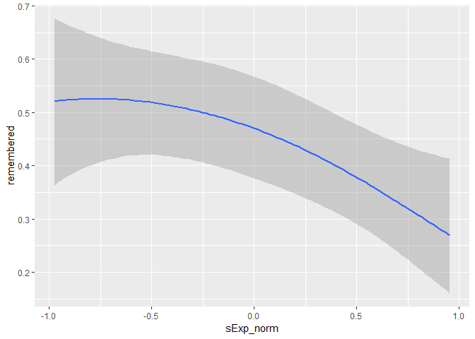
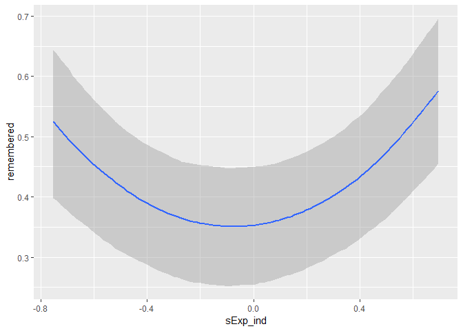
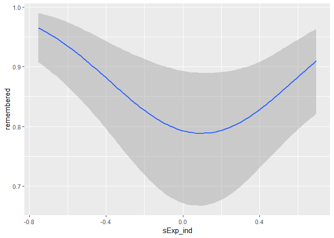
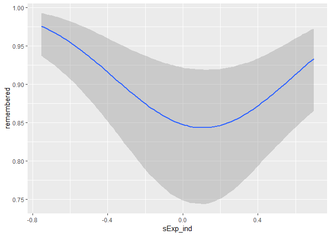
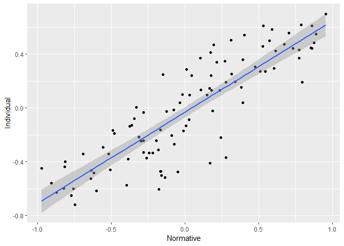
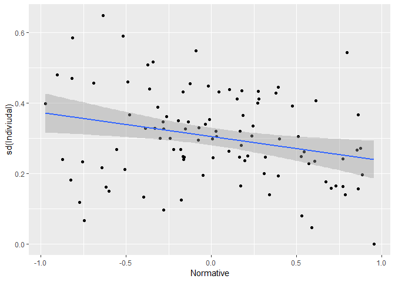
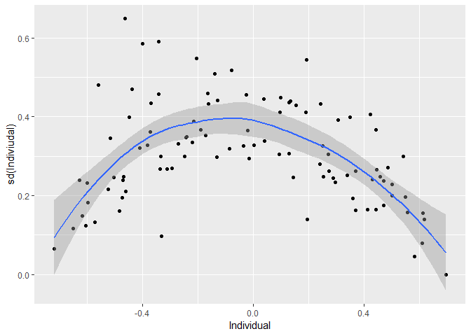

Explaining remember results
================

Normative data (model 1)
========================

    ##                         Estimate Est.Error       Q2.5      Q97.5
    ## Intercept             -0.1181169 0.1968154 -0.5027479  0.2723450
    ## sExp_norm             -0.5695226 0.1759495 -0.9177244 -0.2209017
    ## IsExp_normMUsExp_norm -0.3680024 0.3176267 -0.9907763  0.2481658

All trials (model 2)
====================

    ##                       Estimate Est.Error        Q2.5      Q97.5
    ## Intercept           -0.6200973 0.2324659 -1.07357523 -0.2003041
    ## sExp_ind             0.2347165 0.1569434 -0.08288053  0.5367022
    ## IsExp_indMUsExp_ind  1.5783994 0.3796973  0.85947257  2.3397798

Correct only (model 3)
======================

    ##                       Estimate Est.Error       Q2.5     Q97.5
    ## Intercept            1.3614846 0.3567561  0.7158902 2.1195787
    ## sExp_ind            -0.5375808 0.3664858 -1.2771503 0.1671725
    ## IsExp_indMUsExp_ind  2.7797701 0.8966961  1.0765762 4.5874354

R + all others only correct (model 4)
=====================================

    ##                       Estimate Est.Error      Q2.5     Q97.5
    ## Intercept            1.7321458 0.3512019  1.089948 2.4668326
    ## sExp_ind            -0.5823258 0.3628700 -1.312485 0.1116072
    ## IsExp_indMUsExp_ind  2.7467427 0.8741852  1.082163 4.5137460

Average rating of subject correlated with normative data
========================================================

    ## 
    ##  Pearson's product-moment correlation
    ## 
    ## data:  combinedData_agg$Individual and combinedData_agg$Individual
    ## t = 469760000, df = 98, p-value < 2.2e-16
    ## alternative hypothesis: true correlation is not equal to 0
    ## 95 percent confidence interval:
    ##  1 1
    ## sample estimates:
    ## cor 
    ##   1

As expected, normative and indiviual ratings are highly correlated per object and location. Interestingly, normative ratings have negative linear relationship the SD of individual ratings.

    ## 
    ##  Pearson's product-moment correlation
    ## 
    ## data:  combinedData_agg$Individual and combinedData_agg$Individual_sd
    ## t = -1.973, df = 98, p-value = 0.05131
    ## alternative hypothesis: true correlation is not equal to 0
    ## 95 percent confidence interval:
    ##  -0.3773883952  0.0009975723
    ## sample estimates:
    ##        cor 
    ## -0.1954588

This is surprising because there is u-shape relationship (as expected because we're approaching the extreme) if I plot it against the indiviudal mean ratings.

