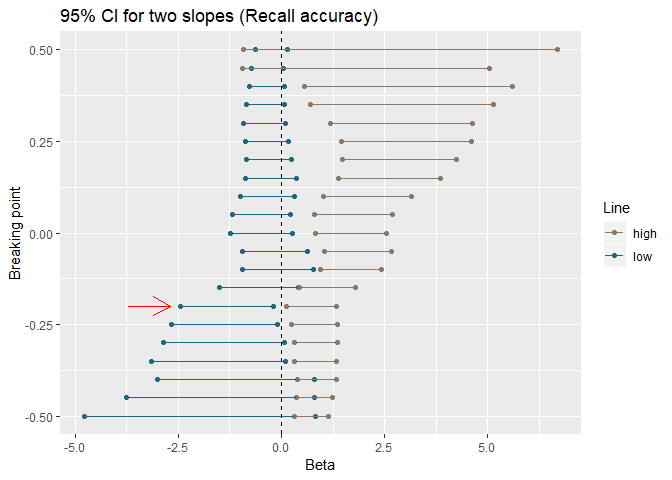
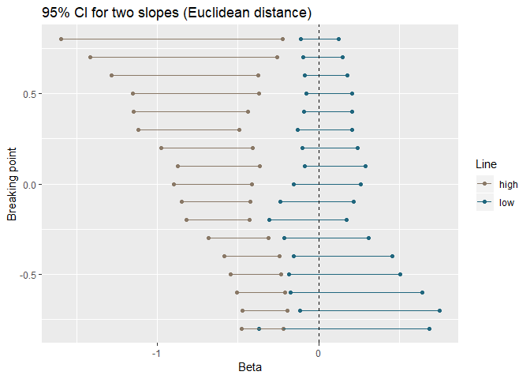
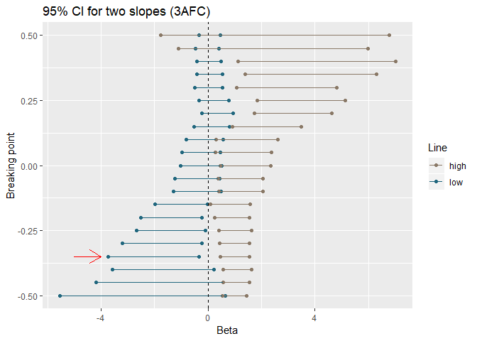

Two lines results
================
Jörn Alexander Quent
22 October 2019

Recall accuracy
===============

For breaking point at -0.2:

| Line |  BF10|
|:-----|-----:|
| Low  |  5.69|
| High |  4.53|

Euclidean distance
==================

There is no breaking point where both CI are not overlapping with zero.

AFC
===

For breaking point at -0.35:

| Line |   BF10|
|:-----|------:|
| Low  |  10.51|
| High |  60.71|
