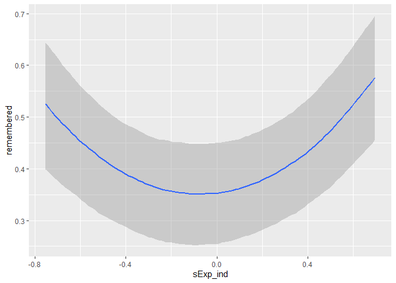

A U-shape that appears as a linear correlation when averaged
================

# The problem

While analysing the data from our U-shape experiments (see
pre-registration for context: <https://osf.io/kcr2q>), we ran into a
peculiar problem. As expected, we did find that memory performance can
be described as a U-shape function of how expected a certain object is
in certain location. However, we also predicted that the memory
advantage for highly incongruent item/locations pairings as well as for
highly congruent pairings are driven by different processes. More
specifically, we predicted that recollection is driving the incongruency
advantage, while familiarity is contributing to the congruency
advantage. In other words, we predicted linear negative as well as
linear positive relationships respectively.

We actually did find a linear negative relationship when averaging
across subjects yielding one data point per item/location pairing.

<!-- -->

In this case, we have a significant negative correlation, r= -.211, p=
.035. We get similar a relationship when we use the normative data that
we collected from 6 participants who viewed all 400 possible pairings
but did not perform a memory task, which is not very surprising as the
correlation between the averaged post-experimental ratings and those
normative ratings are very high, r= .864, p\< .001.

However, if we examine the raw (not averaged) data find a U-shape
instead of a linear relationship, which for instance can be seen in this
visualisation of the marginal effects of a corresponding mixed linear
model.

<!-- -->

This confused us a lot. To investigate what is going one we have plotted
individual loess smoothing lines because we thought maybe we are
observing something like the Simpson’s paradox. Due to the fact that per
participants there are only 20 data points those lines are very noisy
and difficult to interpret.

On the quest to understand this discrepancy, I have noticed that there
seems to be asymmetric spread. For instance, when we look up the
normative ratings for any pairing that received the lowest expectancy
rating possible (-100) and colour those to show the spread,

<!-- -->

we see that there is less (rightward) spread than when we do the same
thing for any pairing that received the highest expectancy rating (100).

<!-- -->

While the mean spread from -100 toward the right is 50.59, the spread
from 100 towards the left is 73.97, which are significantly different, p
= .001. This raises the possibility that averaging introduces and
artefact because of this asymmetry, which why we see this discrepancy.

# Simulation to reproduce this problem

To investigate whether an explanation like this can account for our
discrepancy, we simulated data. This simulation is based on the idea to
have an average expectancy per object. The expectancy for a particular
participants is generated by taking this average expectancy as the mean
of a normal distribution, while using a standard deviation (SD) that
becomes smaller/larger as a function of expectancy.

``` r
# Set up seed
set.seed(1241)

# Parameters
numObj  <- 20
numSub  <- 75
```

Similar to our existing data, we have twenty pairings (i.e. objects) per
participants (n = 75). We start with generating 20 random values between
-100 and 100 for our objects.

``` r
# Give 20 obj true values from uniform distribution between -100 and 100.
trueObj_val <- runif(numObj, -100, 100)
```

In order to have an asymmetric spread, we have to scale the standard
deviation (SD) as function of expectancy.

``` r
sdScale          <- -1

# Have an SD that scales with the true obj values
sd_scaled_by_val <- sdScale*trueObj_val - sdScale*100
```

In the next step we generate expectancy ratings for each participant.

``` r
# For each subject draw a random value with the mean of the object with SD that scales with this value
subjVal <- matrix(NA, numSub, numObj)

for(i in 1:numSub){
  for(j in 1:numObj){
    subjVal[i, j] <- rnorm(1, trueObj_val[j], sd_scaled_by_val[j])
  }
}
```

This process will create values that exceed the range of possible vaues,
therefore everything is capped at -100 and 100.

``` r
# Capping at -100 and 100
subjVal[subjVal > 100]  <- 100
subjVal[subjVal < -100] <- -100

# Everything is bound to one DF
df <- data.frame(sub  = rep(1:numSub, numObj),
                 obj  = rep(1:numObj, each = numSub),
                 trueObj_val = rep(trueObj_val, each = numSub),
                 x    = c(subjVal))
```

To make it easier to compare the results with our analyse we scale the
data to have mean of 0 and SD of 1.

``` r
df$s_trueObj_val <- scale(df$trueObj_val)
df$s_x <- scale(df$x)
```

In the last step, we use those expectancy values to create remember
judgements as a quadratic logistic model.

``` r
# Generating memory performance
beta0 <- 0
beta1 <- 0
beta2 <- 1.2
z     <- beta0 + beta1*df$s_x + beta2*df$s_x*df$s_x # Regression in log odds
pr    <- 1/(1+exp(-z)) # Convert to probability.
df$y  <- rbinom(numObj*numSub, 1, pr) # Get 0 and 1 with binomial link function
```

This leads to this result:

``` r
ggplot(df, aes(x = s_x, y = y)) + 
  geom_jitter(width = 0, height =  0.1) +
  geom_smooth(colour = 'blue') +
  geom_smooth(aes(x = s_trueObj_val), colour = 'red') +
  labs(y = "Remembered (simulated)", x = "Simulated ratings", title = 'Result of simulation')
```

<!-- -->

This shows that true quadratic relationship (blue loess line) can appear
as straight line (red loess line) when averaged. Playing around with
parameters of the regression and the SD scale allows one to easily
create examples where the line is slightly negative.

``` r
# Aggregating to correlate
df_agg <- ddply(df, 
                c('obj', 's_trueObj_val '), 
                summarise, 
                Individual    = mean(s_x),
                Individual_sd = sd(s_x),
                remNum    = sum(y),
                remPer    = mean(y))

# Get correlation
cor3 <- cor.test(df_agg$Individual, df_agg$remPer)
```

In this case the correlation is r = -.732, p \< .001.

``` r
# calculate shift
rightShift <- abs(-100 - df$trueObj_val[df$x == -100])
leftShift  <- abs(100 - df$trueObj_val[df$x == 100])

# T test for the difference
test2 <- t.test(leftShift, rightShift, var.equal = FALSE)
```

If we now calculate the same rightward and leftward shift, we also get a
significant difference, p \< .001.

# Conclusion

It is possible to explain the discrepancy in our data with this
asymmetry. This can be shown with this simulation. The only caveat that
remains is that the empirical relationship between the the averaged
post-experimental ratings and their SD

<!-- -->

is different from the simulated ones as can be seen below.

<!-- -->

However, we believe this is just a matter of findings the right
parameters and is not as important.
