Simulation of logistic regression
================

# Problem

In my power simulation of the U-shape experiment, I noticed that the
suggested priors ([click
here](https://github.com/stan-dev/stan/wiki/Prior-Choice-Recommendations))
actually do not work very well for Bayes Factor (BF) analysis as they
are too flat and hence BF are too conservative. That is because uniform
or very flat priors lead to less evidence in favour of the alternative
hypothesis. Even though undoubtedly Bayesian models and Bayesian
evidence does not have to tell us the exactly the same things that
frequentist statistics do, however I do think it important to have some
level of congruency as well as being clear what kind of sample sizes and
effects we actually need to reach certain criteria that are standard in
my field as valid evidence (p \< 0.05, p \< 005, \(BF_{10}\) \> 6 or
\(BF_{10}\) \> 10). In this document, I therefore report my
investigation how some characteristics of priors relate to evidence that
they are associated with.

Disclaimer, this post is not mentioned as an exhaustive paper but merely
my own attempt to come up with sensible priors for the kind of models
that I run. Especially since there doesn’t seem to be much out there on
this question. With that being said maybe it will be useful for other
people and I am more than happy to get feedback/corrections/questions or
even be told that my reasoning is completely flawed.

# A word on logistic regression

Before we can talk about priors we need to talk about logistic
regression and what the regression coefficients and their size mean. A
great explanation of what probabilities, odds and log odds mean in the
context of logistic regression can be found
[here](https://stats.idre.ucla.edu/other/mult-pkg/faq/general/faq-how-do-i-interpret-odds-ratios-in-logistic-regression/).

\[logit(p) = log(\frac{p}{1-p}) = \beta_0 + \beta_1 x_1 + \cdots + \beta_k x_k.\]
The equation above describes a logistic regression model with several
predictors. The \(\beta\)-values have been logit transformed and
represent log-odds. Odds are ratios of probability. So if you have a 75
% success rate in something that translates to odds of .75/(1 - .75) = 3
or log-odds of log(3) = 1.098612.

As in normal regression, the regression coefficient is relative to the
scale of the predictor variable (e.g. height in cm). For instance, a
coefficient of 1.098612 would mean a 200 % increase in odds to have
success per cm increase in hypothetical example.

Gelman (2008) suggest to scale the predictor variables to have a mean of
0 and a SD of 0.5. In another hypothetical example, we scale our data
accordingly and get a regression coefficient of 0.2231436 or in odds
1.25. This would mean for every time our predictor variables increases
*2 SDs* the odds increase 25 %.

These circumstances illustrate that it is sensible to set some
boundaries on our priors, which essentially means that we don’t expect
coefficients beyond a certain range in the type of work we do. This is a
thought I will revisit in the conclusions to justify the prior I will
choose.

# Influnece of degrees of freedom for Student’s distrubution.

In his recommendation for priors Gelman now follows Ghosh et al. (2015)
and recommends a student distribution with degrees of freedom (df)
between 3 and 7 with a scale of 2.5. For illustration of how Student’s
distribution changes with df, I created this graphic.

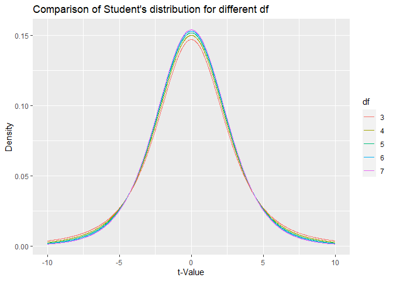<!-- -->

The figure above illustrates that there is an inverse relationship of
the density at the peak and the density at the tails. For comparing df =
3 with df = 7, at the mode of the distribution the df = 7 is higher,
while at the tails the distribution with df = 3 is higher. Increasing
the df basically essentially gives more weight to extreme values. In the
following, I examine how choosing different df affects evidence in a BF
analysis.

# Background on pre-simulation

The data in the simulations were generated data with this function:

``` r
# Function used to generate data
data_generator <- function(numSub, beta0, beta1){
  # Create DF and also scale x 
  df <- data.frame(sub  = rep(1:numSub),
                   x    = rnorm(numSub))
  
  # Scaling based on https://github.com/stan-dev/stan/wiki/Prior-Choice-Recommendations
  # Mean = 0 and SD = 0.5
  df$s_x <- (df$x - mean(df$x))/(sd(df$x)/0.5)
  
  # Predicting memory
  z     <- beta0 + beta1*df$s_x # Regression in log odds
  pr    <- 1/(1+exp(-z)) # Convert to probability.
  df$y  <- rbinom(numSub, 1, pr)
  return(df)
}
```

Note that I follow Gelman’s (2008) recommendation about scaling the
variable to have standard deviation (SD) of 0.5. The considerations
concerning the priors therefore only pertain to this scaling. For the
first simulation, I used the recommended 2.5 for the scale of the
Student’s distribution (1000 iterations per condition).

``` r
priors_student_1  <- c(prior(student_t(3, 0, 10) , class = "Intercept"),
                       prior(student_t(3, 0, 2.5) , class = "b")) 
```

In a second simulation, I contrasted the results with a scale of 1 for
the Student’s distribution (5000 iterations per condition).

``` r
priors_student_1  <- c(prior(student_t(3, 0, 10) , class = "Intercept"),
                       prior(student_t(3, 0, 1) , class = "b")) 
```

In both simulations I used the following df of 3, 4, 5, 6 and 7. The
simulations included simulated sample size of 100 for all simulations.
The BRMS model that was used for fitting was this one:

``` r
brm(y ~ s_x,
    data = df,
    prior = priors_student_1,
    family = bernoulli(),
    chains = 1,
    save_all_pars = TRUE,
    sample_prior = TRUE,
    save_dso = TRUE, 
    seed = 6353) 
```

# Analyse simulation

## Simulation 1 (Scale = 2.5)

In this first simulation, I used \(\beta_1\) between 0 and 0.7. The
average FPR for a \(BF_{10}\) \> 6 for the priors with this scale is
0.0078 (0.001924) showing in general that this method is more
conservative than a frequentist model would be. One obvious reason for
this that the BF in contrast to the p-value is not uniformly distributed
and it gets smaller and smaller with more data (for a null effect). In
my frequentist simulation (see below), the nominal FPR was 0.045 for p
\< 0.05.

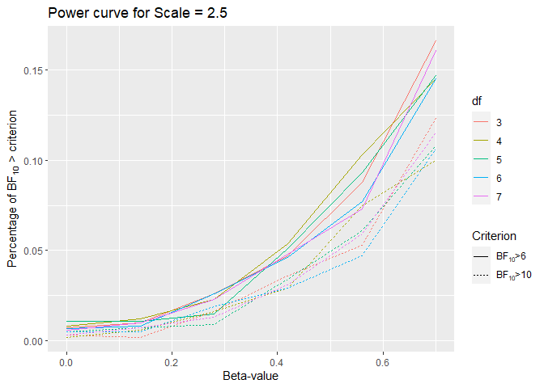<!-- -->

This power curve shows how badly the prior performance is. Even with a
beta of 0.7 or odds of exp(0.7) = 2.013753, we only barely get past 15%.
This is quite different from what we would get if we used frequentist
models. That the prior is too wide contributes to the general
conservatism problem of BF analysis, as I show in the next simulation.

## Simulation 2 (Scale = 1)

In the next step, I ran a simulation with scale parameter of 1. To
illustrate the difference between a scale of 2.5 and a scale of 1. Here
both plotted on the same axis. For comparison, I also overlaid a normal
prior, N(0, 1) illustrated by the dashed line.

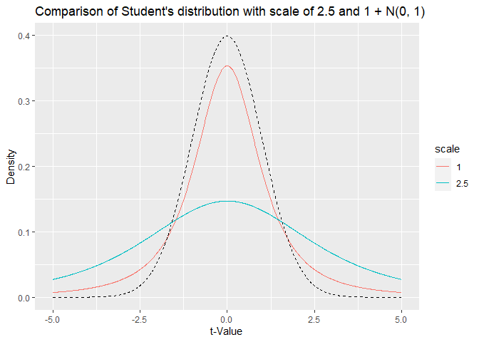<!-- -->

The student’s distribution with scale of 2.5 is far too wide explaining
the low ‘power’ for \(BF_{10}\) \> 6. To see, how a prior with scale of
1 behave I ran Simulation 2. In this simulation, the \(\beta_1\)-values
range from 0 to 2.

The average FPR for a \(BF_{10}\) \> 6 for the priors with this scale is
0.01288 (0.00111), which is still quite low compared to frequentist
models.

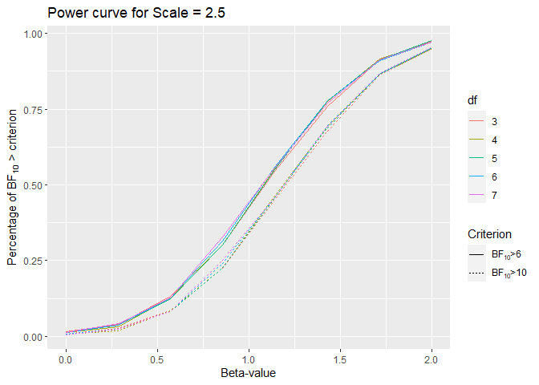<!-- -->

Looking at the power curve it seems that there is no big difference for
different df.

## Comparison of slope estimation

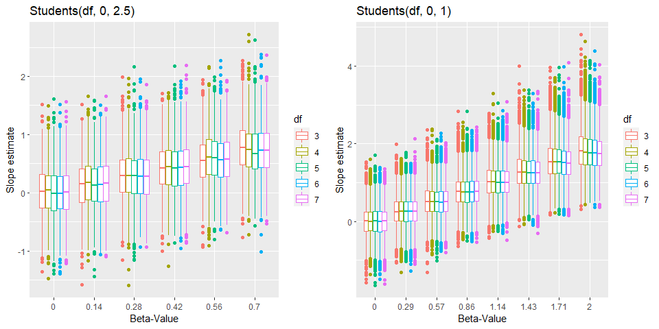<!-- -->

In addition, we can look at the shrinkage properties. By comparing the
true and the average estimated slope in scatter plot.

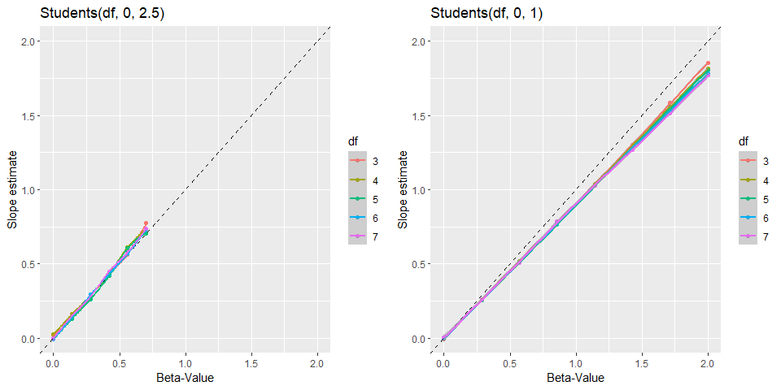<!-- -->

Despite the different ranges (0 to 0.7 and 0 to 2) in the simulations,
it is obvious that narrower priors leads to more shrinkage toward zero.
This is probably a good feature as this protects us from overestimating
the effect.

# Interim conclusion

My interim conclusion is that the suggested scale of 2.5 is too wide for
BF analysis. Hence, I will run another simulation comparing normal
versus student priors with scales of 1, 1.5, 2 and 2.5 to investigate
this issue further.

# Illustrative example

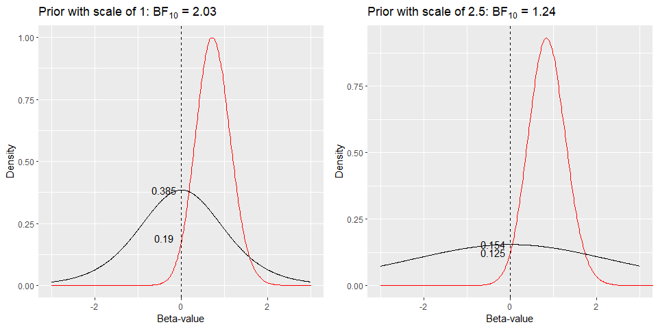<!-- -->

Before looking at the results, here is a quick illustration why this is
the case. Above, two figures showing the analysis of the same data can
be seen. The left one uses a scale of 1, the other one uses a scale of
2.5. The \(BF_{10}\) are 2.03 and 1.24. The figures illustrate the
[Savage-Dickey
method](https://www.ejwagenmakers.com/2010/WagenmakersEtAlCogPsy2010.pdf)
of calculating BF that is taking the ratio of the prior probability at
zero and posterior probability at zero. While the posterior
probabilities are similar with 0.19 and 0.125, the prior probabilities
at zeros are very different 0.385 versus 0.154. This explains the
difference in the BF that we get using both scales.

# Frequentist comparison

In order to get a better idea how conservative the power curve from the
Bayesian models are I also quickly run the same simulation with a
frequentist model (10,000 iteration per \(\beta_1\) value).

The model that I used was:

``` r
glm(y ~ s_x, data = df, family = "binomial")
```

# Full simulation

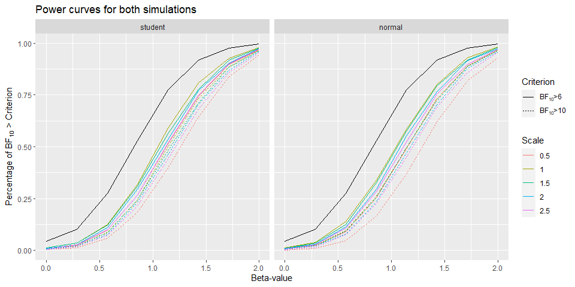<!-- -->

Above the power curves of this simulation can be found. The black line
represents the power curve for equivalent frequentist model and shows
that all priors are more conservative.

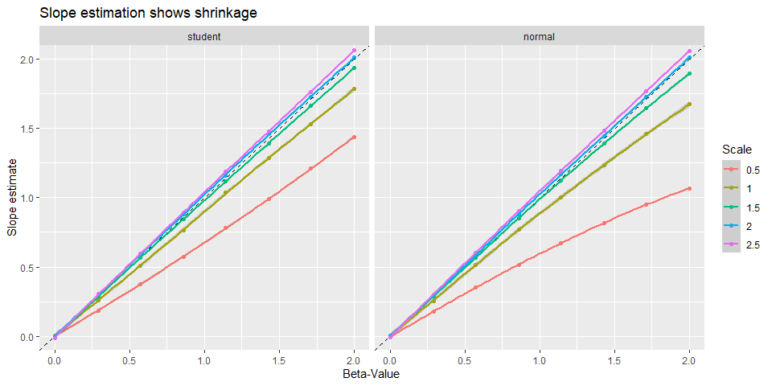<!-- -->

In contrast to Bayesian models, for the frequentist simulation we don’t
find shrinkage of the estimator towards zero.

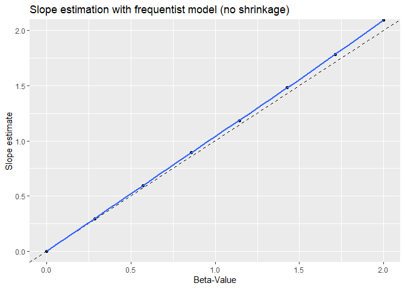<!-- -->

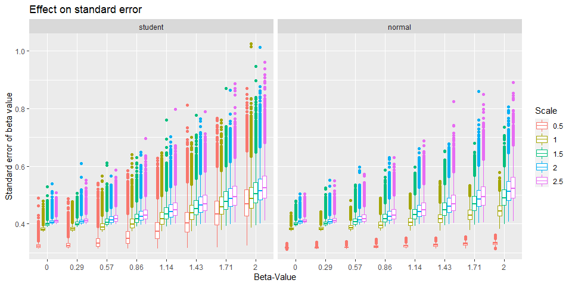<!-- -->

One thin that stand out when comparing the standard error is abnormally
low for a prior with scale of 0.5 irrespective of the family.

One other number we can look at is the effective sample size. This
number is not referring to the effect size of the coefficient but how
many samples for analysis are effectively available. The more the better
because estimation especially of the BF get more stable the more samples
we’ve got.

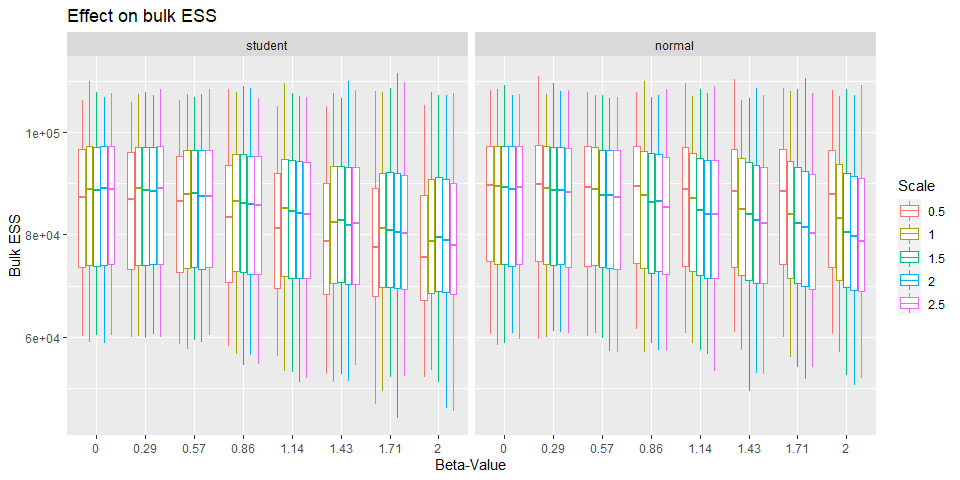<!-- -->

Here we see something interesting that is while the bulk ESS decreases
for a scale of 0.5 as the beta-value get larger for the student prior,
the opposite is true for the normal prior.

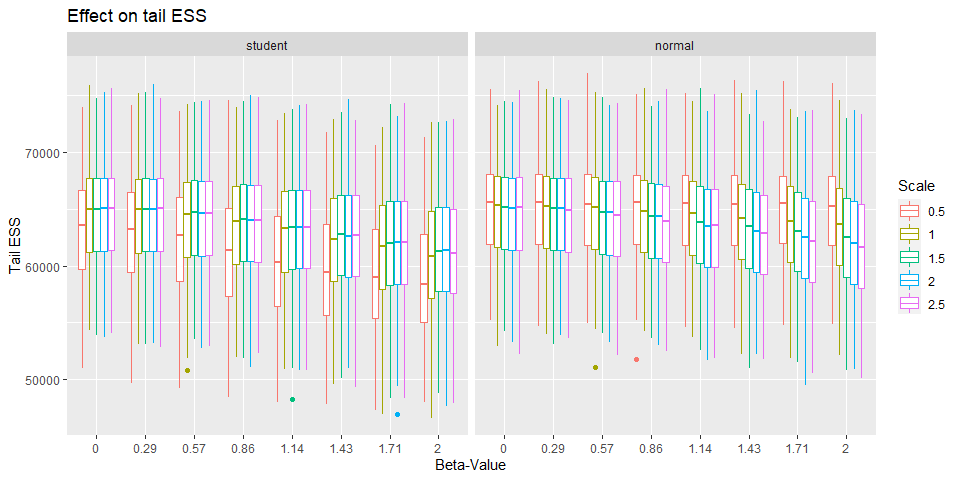<!-- -->

Yet again the reverse is true for tail ESS. This probably indicates that
a scale of 0.5 is too narrow.

# Conclusions

Several things can be learned from the simulations.

Now, if look which values these distributions include as likely by
comparing the middle 95% of them, we see what that means in terms of
odds and change per 2 SD increase in our predictor variable. Here are
two tables for the upper boundaries (i.e. 97.5 %) for both normal and
student distributions showing the regression coefficients as log odds.

Normal distribution:

| scale |     coef |   odds | change |
| ----: | -------: | -----: | -----: |
|   0.5 | 0.979982 |   2.66 |    166 |
|   1.0 | 1.959964 |   7.10 |    610 |
|   1.5 | 2.939946 |  18.91 |   1791 |
|   2.0 | 3.919928 |  50.40 |   4940 |
|   2.5 | 4.899910 | 134.28 |  13328 |

Student distribution:

| scale |     coef |   odds | change |
| ----: | -------: | -----: | -----: |
|   0.5 | 1.182312 |   3.26 |    226 |
|   1.0 | 2.364624 |  10.64 |    964 |
|   1.5 | 3.546936 |  34.71 |   3371 |
|   2.0 | 4.729248 | 113.21 |  11221 |
|   2.5 | 5.911561 | 369.28 |  36828 |

One thing immediately apparent is that a scale of 2.5 still ‘treats’
values that correspond to a change of 13328 % & 36828 % per 2 SD on the
predictor as likely. Generally, the fact that the student distribution
has higher tails still allows for larger values. That is despite the
fact that power for a normal prior versus a student prior (df = 7) with
a scale of 1 are not systematically different. This is therefore an
argument for using a student prior.

Furthermore, a student prior typically fits posterior distributions
better (according to my limited experience), which is an advantage when
trying to use previous posteriors as priors for new analyses. Using
student priors throughout therefore eases comparison.

Even if for particular posterior distribution a normal is better fit
then a student, then this will be alleviated by the fact the estimated
df will just be very large as a student distribution will be identical
for infinitely large df. *To sum up, I will now use a student
distribution with mean = 0, scale = 1 and df = 7 as the standard prior
for logistic regression models.*
