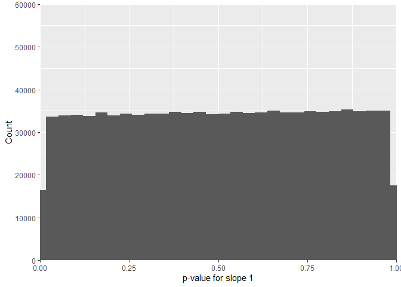
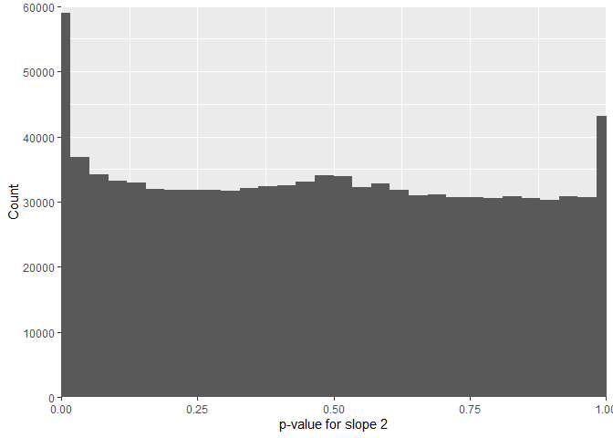
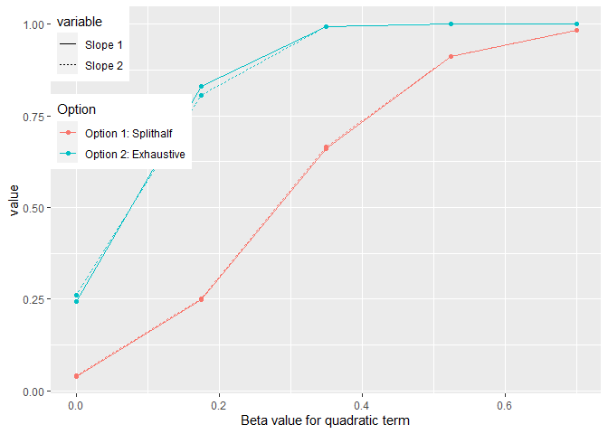
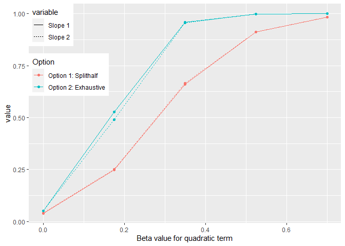
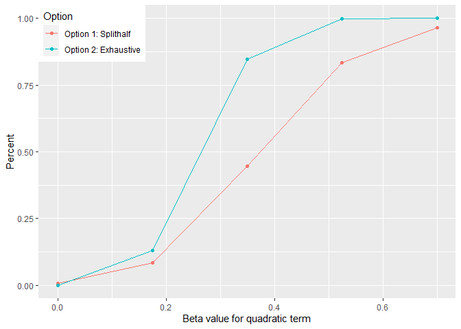
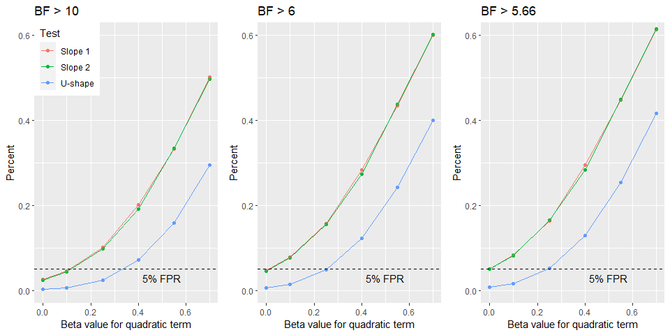

What is the best analysis to find a U-shape?
================

# The outset of the problem

In one of my project, I’d like to show that there is a U-shape
relationship between two variables. The traditional way to do this would
be to fit a quadratic model and test whether the quadratic term is
different from zero. However, [Simonsohn
(2018)](https://journals.sagepub.com/doi/10.1177/2515245918805755#)
among other correctly points out that evidence for a quadratic fit is
not enough and there might be situations where the quadratic term is not
zero but there is no true u-shape.

To avoid this, Simonsohn proposed to use interrupt regression that tests
whether each slope is different from zero. While the exact proposal
(Robin Hood algorithm) might work well for frequentist statistics, it is
not clear how we can adopt this for our Bayesian models. The main
question being that it is unclear how to choose the correct breaking
point. This is what I explore here extensively as a preparation for a
pre-registration [(for context click on link)](https://osf.io/4sw2t/).

# Explanation of the simulation

We identified two options to analyse our data with interrupted
regression or more specifically how to find the best breaking point.

**Option 1** is to split the data in half using a spline (or similar) to
find the minimum/maximum in one half of the data and then analyse the
other half of the data to test whether both slopes at a that point are
significantly different from 0.

**Option 2** is to use all data and test a whole range of points within
an interval and then apply an appropriate correction for multiple
testing. The aim of this document is to explore all the options and
their implications. Also whether correction is necessary at all.

For option 1, I subset the simulated data to only include the middle 80%
and then find the minimum via smoothing model. The smoothing model is
the same used by Simonsohn’s two line test, which is a general additive
model using a cubic regression spline. When I played around with it, it
usually did a good job finding the point that would also be chosen via
visual examination for the plotted loess line. I used only 80 % of the
middle because especially when the \(\beta_2\) is zero, the minimum was
often the extreme points, which make a meaningful estimation impossible.
An alternative for this could be to fit the smoothing model to the full
range of the values but to only consider minima within the middle 80 %
but this wasn’t tested here.

For option 2, I also restricted the range to same middle 80%, for which
10 breaking points evenly spaced out were examined. For each different
\(\beta_2\) I run 100,000 simulations.

Also note that some models couldn’t be estimated that is because some
model didn’t return a minimum or only return NA. This happens
particularly often in the frequentist models.

I start with frequentist mixed linear models to get an idea how both
options compare in terms of how they behave and use those results as a
perspective for the Bayesian implementation.

Like in the two-line test we fitted two individual models to the data.
One model to get the p-value/BF for slope 1 that includes the breaking
point. Since in this model slope 2 can’t contain the breaking point, we
fitted another model where the breaking point is included in slope 2 but
not slope 1, so that both slopes include the minimum/maximum and make
best use of the data.

Note that links to the repository will be added at a later time point.
If you read this in the far future and I haven’t done this yet, feel
free to kick me.

# Frequentist models

## Using previous data to generated null data by shuffling

In order to find a way for appropriate multiple testing correction that
is less severe than Bonferroni, I shuffled the 0 and 1 of original data
[(for context click on link)](https://osf.io/4sw2t/) within subjects.
This means that the average performance within subjects as in our actual
data that we want to analyse after pre-registration is the same but the
information for objects is lost. Due to the fact that in our example
each subject only saw each type of object once, we cannot shuffle within
both subjects and objects. After shuffling mixed linear models with a
random intercept are fitted to the data following this equation

y \~ xlow + xhigh + high + (1 | sub).

Now, we examine the results of this simulation.

The FDR for U-shapes for null data generated by shuffling 0 and 1 within
subjects is 3.796 % for mixed linear model with random intercept for
subjects and objects. For slope 1 its 27.508 % and for slope 2 50.297 %.
This shows an extreme asymmetry that can be traced down to the
distribution of the p-values of the shuffled original data.

While the p-value for slope 1 is nicely uniform,

<!-- -->

the p-values for slope 2 show extreme pikes at 0 and 1.

<!-- -->

This is not due to an error in the code but due to the fact that the
x-values are always the same with this shuffling method. When I randomly
generated x-values like in the quadratic simulation below, we get the
similar FPR for both slopes. To be sure about this, I ran a normal glm
(without random effects) and got similar results, which means that the
problem is not the model but the shuffled data where the x-values remain
unchanged.

On a side note, I found for 18.7 % of the cases I had some kind of
convergence warning while fitting the mixed linear model but since the
glm showed the same results, this is not an important issue but shows
how Bayesian models might be more robust against these kind of things.

## One Slope \< 0.05

With this simulation, I can now look for an alpha level for individual
slopes so that we only have one or more significant slopes per iteration
across the breaking points in 5 % of the cases.

For the shuffled data we get an alpha level of 0.0068 for individual
slopes. This mean that we can accept the significance of individuals
slopes if the p-value is below that level and still only be wrong in 5%
of the cases. This is already slightly less conservative than a
Bonferroni correction.

# Quadratic simulation

To show that a) the data generated de-novo is not skewed like the
shuffled above and b) to draw a power curve I ran another simulation
that generated data via quadratic logistic regression with 100,000
iterations per \(\beta_2\) (0, 0.175, 0.35, 0.525, 0.7). All simulations
are run with sample size of 80. In the first step, I optimise the alpha
level for the generated data in the same way I did above. The data was
generated with this function:

The optimised alpha level for individual slopes is very similar for both
slopes. Averaged it is p \< 0.0081604.

There are two things we can look at. First is how two both methods fair
in detecting significant individual slopes in terms of power and fpr.
The second thing we can look is how do the methods fair when the aim is
to detect a U-shape (i.e. two significant slopes) especially once we
corrected for multiple comparison.

## Power curves for individual slopes

The FPR for generated data analysed with option 2 are 0.25073 and
0.26067.

<!-- -->

In the following are the corrected slopes:

<!-- -->

At this point we can also look at the distribution of p-values for those
simulated x-values.

Also, just as a quick side note. When the data is generated instead of
shuffled the p-values for both slopes follow a nice uniform
distribution.

## Power for detecting u-shape after correction

Now, we can examine how this correction procedure affects the abilitiy
to detect a U-shape using both methods implemeneted as frequentist
models.

<!-- -->

As can be seen above, option 2 fares much better than option 1 even
after quite rigorous correction of multiple comparison.

One possible reason that option 1 fares poorly is that the estimation of
the breaking point is very noisy. In fact the mean absolute difference
is 0.7478701, which is quite large considering the range of values on
the predictor variable in the simulation (min = -2.439 and max = 1.58).
Typically, the values range between (+/- 1.2) though.

## Conclusion

This simulation has shown that the FPR rate is indeed increased for
individual slopes when testing 10 breaking points per analysis. However,
this can be alleviated with appropriate correction of the alpha level
for the individual slopes. Not that the correction is markedly less
strict than a Bonferroni correction (\(\alpha\) divided by the number of
tests).

We can conclude that option 2 is preferable to option 1. Now in the next
step, we apply the same approach to our Bayesian model and see how this
behaves under the same circumstances.

# Bayes factors

I used the same data generating function for this simulation and we also
used 100,000 iterations with a \(\beta_2\) of 0. For the Bayesian model
I used these priors (for justification to use these priors see
[here](https://jaquent.github.io/post/the-priors-that-i-use-for-logsitic-regression-now/))

``` r
priors  <- c(prior(student_t(7, 0, 10) , class = "Intercept"),
             prior(student_t(7, 0, 1) , class = "b")) 
```

and the following model.

``` r
# Preparation for interrupted regression (for more info see Simonsohn, 2018) of slope 1.
breakingPoints <- 0 # In this case I'd split it at zero. 
x              <- df$s_x 
df$xlow        <- ifelse(x <= breakingPoints, x - breakingPoints, 0)
df$xhigh       <- ifelse(x > breakingPoints, x - breakingPoints, 0)     
df$high        <- ifelse(x > breakingPoints, 1, 0)

# The model 
brm(y ~ xlow + xhigh + high,
    data = df,
    prior = priors,
    family = bernoulli()) 
```

Note that I didn’t add a random intercept because even when only using a
total number of samples of 9000, adding a random intercepts would have
increased the run time of this simulation significantly. The data was
generated and scaled with this function:

This null data allows us to examine which \(BF_{10}\) we could accept as
individual slopes despite multiple testing and still retain a FPR of 5 %
in total.

The results show in contrast to frequentist models where we have to
lower the alpha level compared to the convention (p \< 0.05) that we
could accept \(BF_{10}\) as low as 5.66 have the same FPR rate as we
have for the frequentist models. Typically, journals accept a
\(BF_{10} > 6\) and sometimes a \(BF_{10} > 10\) as sufficient evidence.
The main reason for this stark discrepancy between frequentist and
Bayesian statistics is that the latter are far more conservative than
the former.

In our case, the FPR for individual slopes is 4.66 % with
\(BF_{10} > 6\) without any form of correcting for the fact that we ran
multiple tests on the same data. This is based on 100,000 simulations.

Now we can examine the ‘power’ curve for our Bayesian model as function
of using different \(BF_{10}\) criteria.

<!-- -->

# Conclusion

The frequentist simulation showed without doubt that option 2 is better
way of analysing the data. However, it also showed that testing multiple
breaking points inflates the Type 1 error. The Bayesian simulation on
the other hand provide us with evidence that is not an issue for this
type of analysis as the FPR is much lower than that what we accept for
frequentist models. That means that we could even lower the \(BF_{10}\)
to for accepting non-zero slopes below the commonly accepted evidence
criterion of \(BF_{10} > 6\) and still have a FPR of 5 %
(i.e.\(BF_{10} >\) 5.66). However, I do not propose to do this but stick
with accepting individual slopes if they have a \(BF_{10} > 6\), which
provides me with enough confidence. Especially since we need both lines
to surpass this level of evidence at the same time to conclude that we
have U-shape.

In sum, I conclude that it is fine to take a \(BF_{10} > 6\) as evidence
for a non-zero slope even if I test 10 different breaking points for our
data.
