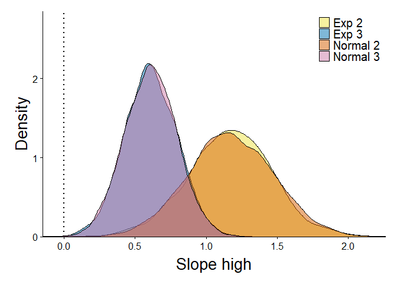
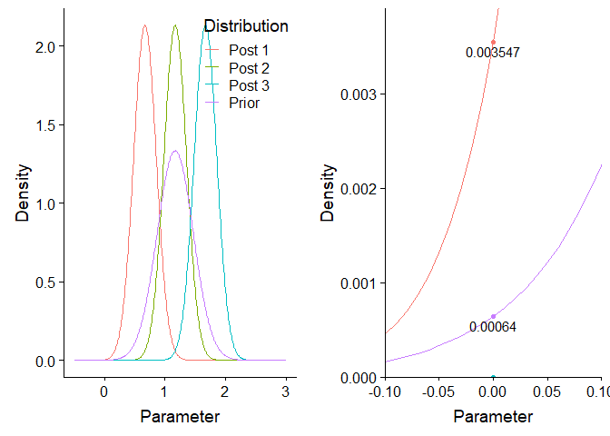
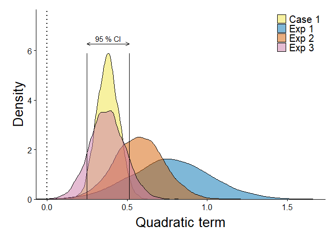
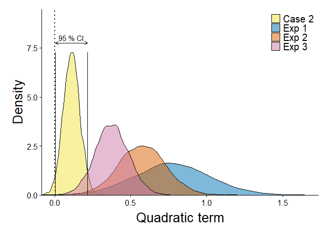
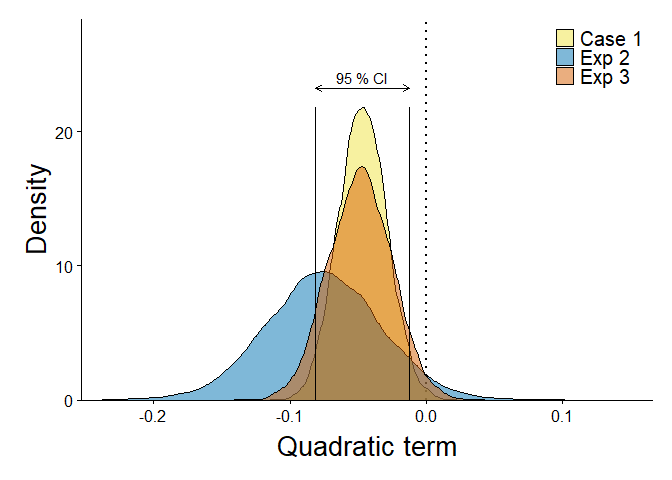
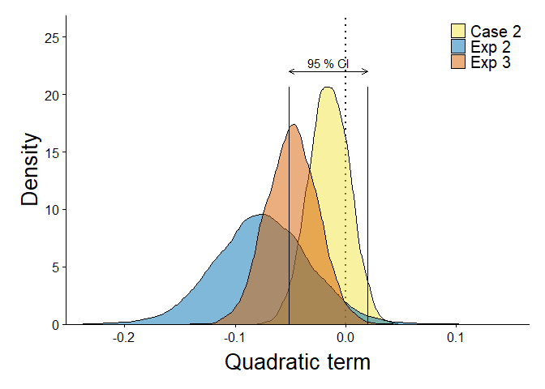

Finding the right analysis for schemaVR4
================

General stuff
=============

In order to test my hypothesis. I thought to use the BRMS function hypothesis. For point hypotheses, this function calculates the Savage-Dickey density ratio method. I am following this example [here](https://vuorre.netlify.com/post/2017/03/21/bayes-factors-with-brms/).

    ## [1] 9.309091

    ## Hypothesis Tests for class b:
    ##    Hypothesis Estimate Est.Error CI.Lower CI.Upper Evid.Ratio Post.Prob
    ## 1 (xhigh) = 0     0.61      0.19     0.24     0.97      19.83      0.95
    ##   Star
    ## 1    *
    ## ---
    ## '*': The expected value under the hypothesis lies outside the 95%-CI.
    ## Posterior probabilities of point hypotheses assume equal prior probabilities.

As can be seen above, the posterior nively follow normal distributions. Therefore, I will use the dnorm function to calculate the ratio.

    ## [1] 16.31005

    ## [1] 0.06131189

    ## [1] 127.8799

U-Shape
=======

Quadratic term
--------------

### Analysis of previous experiments

| Experiment |       BF01|         BF10|
|:-----------|----------:|------------:|
| schemaVR2  |  4.2983115|    0.2326495|
| schemaVR3  |  0.0021764|  459.4658396|
| combined   |  0.0093550|  106.8944959|

|                                         |  Estimate|  Est.Error|    Q2.5|   Q97.5|
|-----------------------------------------|---------:|----------:|-------:|-------:|
| Intercept                               |    -0.890|       0.29|  -1.489|  -0.358|
| objLocTargetRating                      |     0.136|       0.09|  -0.041|   0.314|
| IobjLocTargetRatingMUobjLocTargetRating |     0.376|       0.11|   0.166|   0.596|

Now, I simulated data for two cases: data that is similar to schemaVR1 and schemaVR2 (case 1) and data where the true effect is zero (case 2).

### Case 1

#### Coefficients

|                                             |  Estimate|    SE|      Z|    P| Sig    |
|---------------------------------------------|---------:|-----:|------:|----:|:-------|
| (Intercept)                                 |     -1.62|  0.30|  -5.33|    0| \*\*\* |
| objLocTargetRating                          |      0.31|  0.07|   4.17|    0| \*\*\* |
| I(objLocTargetRating \* objLocTargetRating) |      0.38|  0.08|   4.57|    0| \*\*\* |

|                                         |  Estimate|  Est.Error|    Q2.5|   Q97.5|
|-----------------------------------------|---------:|----------:|-------:|-------:|
| Intercept                               |    -1.452|      0.227|  -1.900|  -1.024|
| objLocTargetRating                      |     0.238|      0.057|   0.128|   0.347|
| IobjLocTargetRatingMUobjLocTargetRating |     0.379|      0.068|   0.250|   0.514|

#### Posterior distribution

#### Evidence ratios

| Experiment |       BF01|           BF10|
|:-----------|----------:|--------------:|
| schemaVR2  |  0.0021764|   4.594658e+02|
| schemaVR3  |  4.2983115|   2.326495e-01|
| case 1     |  0.0000000|  -3.346732e+16|
| combined   |  0.0000000|  -3.577472e+18|

### Case 2

#### Coefficients

|                                             |  Estimate|    SE|      Z|       P| Sig |
|---------------------------------------------|---------:|-----:|------:|-------:|:----|
| (Intercept)                                 |     -0.14|  0.09|  -1.50|  0.1337|     |
| objLocTargetRating                          |     -0.03|  0.05|  -0.57|  0.5698|     |
| I(objLocTargetRating \* objLocTargetRating) |      0.03|  0.06|   0.49|  0.6245|     |

|                                         |  Estimate|  Est.Error|    Q2.5|   Q97.5|
|-----------------------------------------|---------:|----------:|-------:|-------:|
| Intercept                               |    -0.269|      0.095|  -0.461|  -0.087|
| objLocTargetRating                      |     0.013|      0.047|  -0.080|   0.107|
| IobjLocTargetRatingMUobjLocTargetRating |     0.111|      0.054|   0.005|   0.217|

#### Posterior distribution

#### Evidence ratios

| Experiment |        BF01|         BF10|
|:-----------|-----------:|------------:|
| schemaVR2  |   0.0021764|  459.4658396|
| schemaVR3  |   4.2983115|    0.2326495|
| case 2     |  64.6375892|    0.0154709|
| combined   |   0.6046859|    1.6537513|

Two line test
-------------

Before I start the two-line test it's important to check how different the minima of the quadratic terms are.

| Experiment |     Minimum|
|:-----------|-----------:|
| schemaVR1  |  -0.1440568|
| schemaVR2  |  -0.1939130|
| schemaVR3  |  -0.2965426|

I will there use the value of schemaVR3 of the -0.2115041 as the breaking point for all analyses. I based on the average of the BRMS estimates.

Recollection
============

Analysis of previous experiments
--------------------------------

| Experiment |       BF01|      BF10|
|:-----------|----------:|---------:|
| schemaVR3  |  0.9475113|  1.055396|

|                    |  Estimate|  Est.Error|    Q2.5|   Q97.5|
|--------------------|---------:|----------:|-------:|-------:|
| Intercept          |     0.466|      0.024|   0.418|   0.514|
| objLocTargetRating |    -0.048|      0.023|  -0.094|  -0.004|

Case 1
------

|                    |  Estimate|    SE|     DF|      T|       P| Sig    |
|--------------------|---------:|-----:|------:|------:|-------:|:-------|
| (Intercept)        |      0.47|  0.03|  19.47|  13.90|  0.0000| \*\*\* |
| objLocTargetRating |     -0.04|  0.03|  80.30|  -1.52|  0.1328|        |

|                    |  Estimate|  Est.Error|    Q2.5|   Q97.5|
|--------------------|---------:|----------:|-------:|-------:|
| Intercept          |     0.467|      0.020|   0.429|   0.505|
| objLocTargetRating |    -0.047|      0.018|  -0.081|  -0.012|

#### Posterior distribution

#### Evidence ratios

| Experiment |       BF01|      BF10|
|:-----------|----------:|---------:|
| schemaVR3  |  0.9475113|  1.055396|
| case 1     |  0.4675199|  2.138946|
| combined   |  0.4429804|  2.257436|

Case 2
------

|                    |  Estimate|    SE|     DF|      T|       P| Sig    |
|--------------------|---------:|-----:|------:|------:|-------:|:-------|
| (Intercept)        |      0.47|  0.03|  19.47|  13.90|  0.0000| \*\*\* |
| objLocTargetRating |      0.04|  0.03|  80.30|   1.52|  0.1329|        |

|                    |  Estimate|  Est.Error|    Q2.5|  Q97.5|
|--------------------|---------:|----------:|-------:|------:|
| Intercept          |     0.466|      0.019|   0.428|  0.505|
| objLocTargetRating |    -0.015|      0.018|  -0.051|  0.020|

#### Posterior distribution

#### Evidence ratios

| Experiment |       BF01|       BF10|
|:-----------|----------:|----------:|
| schemaVR3  |  0.9475113|  1.0553964|
| case 2     |  6.7953769|  0.1471589|
| combined   |  6.4386965|  0.1553109|
