Power analysis
================

Introduction
============

In this document, I check the fitted model with data from schemaVR1, schemaVR2 and schemaVR3 by running posterior predictive checks and then report the results of the power analyses. The power analyses are all based on the results from the previous models.

Different hypotheses
--------------------

Here I visualise the different hypotheses and how the corresponding BFs are approximated with the Savage-Dickey-ratio.

### Unrestricted (mu = 0 vs. mu != 0)

``` r
### Code pasted and adapted from Wagenmakers et al. (2010) found here: http://www.ejwagenmakers.com/papers.html
# Generating data
N       <- 10000
simData <- rnorm(N, 1.5, 1)

# Estimating logspline density at zero for posterior
fit.posterior  <- logspline(simData)
posterior      <- dlogspline(0, fit.posterior) # Gives the density at zero

# Estimating logspline density at zero for prior N(0, 1)
prior          <- dnorm(0 ,0, 1)

# Calculate BF
BF01           <- posterior/prior
BF10           <- 1/BF01
```

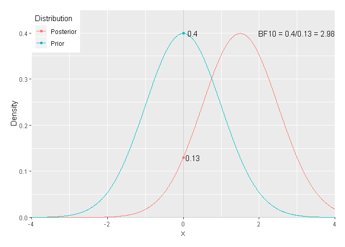

### Order-restricted (mu = 0 vs. mu &gt; 0)

``` r
### Code pasted and adapted from Wagenmakers et al. (2010) found here: http://www.ejwagenmakers.com/papers.html
# Estimating logspline density at zero for posterior
areaPosterior  <- sum(simData > 0)/length(simData) # gets area over zero
posterior.OR   <- posterior/areaPosterior # Normalises so that density is 1

# Estimating logspline density at zero for prior N(0, 1)
prior          <- dnorm(0 ,0, 1)
areaPrior      <- integrate(dnorm, mean = 0, sd = 1, lower = 0, upper = Inf, abs.tol = 0)$value
prior.OR       <- prior/areaPrior

# Calculate BF
BF01           <- posterior.OR/prior.OR
BF10           <- 1/BF01
```

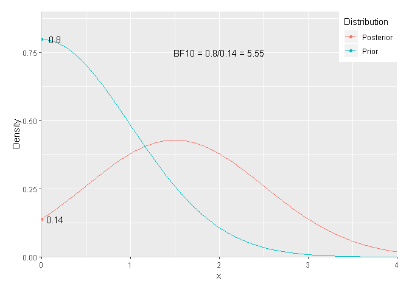

I decide to go for the order-restricted way to calculate BF10.

Recall
======

PPC
---

Observed data (y) vs. simulated data (yrep): 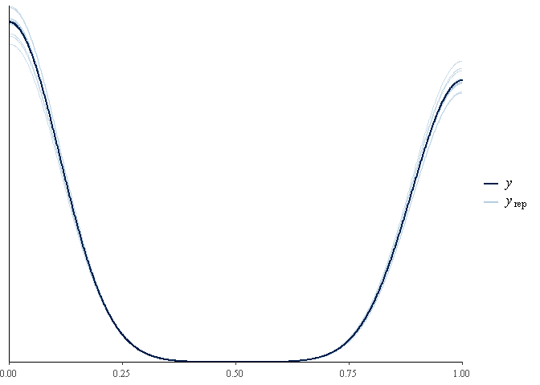

How well did we capture the mean? 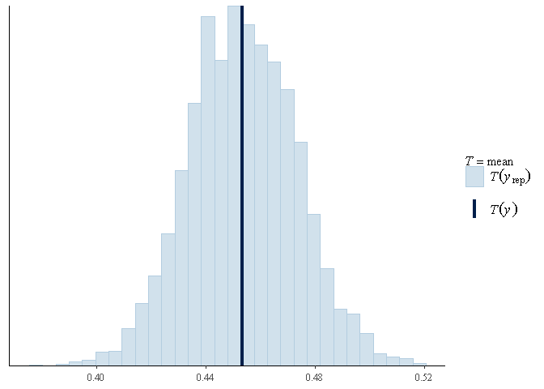

Results of previous experiments
-------------------------------

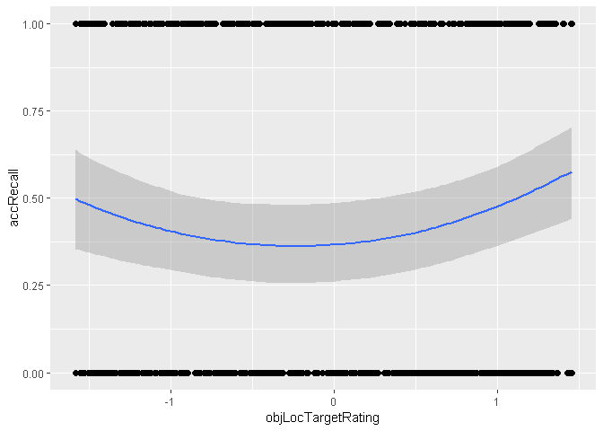

| Method |   BF01|  BF10|
|:-------|------:|-----:|
| BRMS   |  0.049|  20.5|
| UR     |  0.051|  19.6|
| OR     |  0.026|  39.2|

Power analysis
--------------

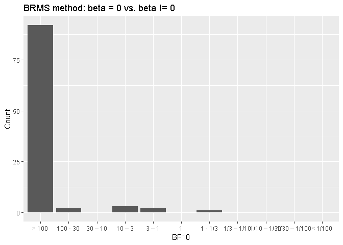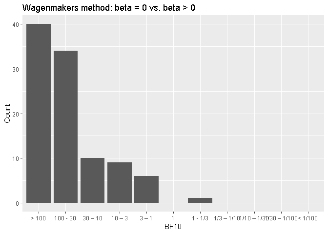

Without taking previous BF10 into account:

| Method |  Over6|  Over10|
|:-------|------:|-------:|
| BRMS   |   0.96|    0.94|
| UR     |   0.89|    0.84|
| OR     |   0.89|    0.84|

With taking previous BF10 into account:

| Method |  Over6|  Over10|
|:-------|------:|-------:|
| BRMS   |      1|       1|
| UR     |      1|       1|
| OR     |      1|       1|

Recollection
============

PPC
---

Observed data (y) vs. simulated data (yrep): 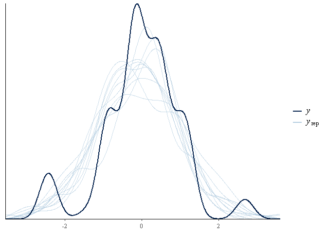

How well did we capture the mean? 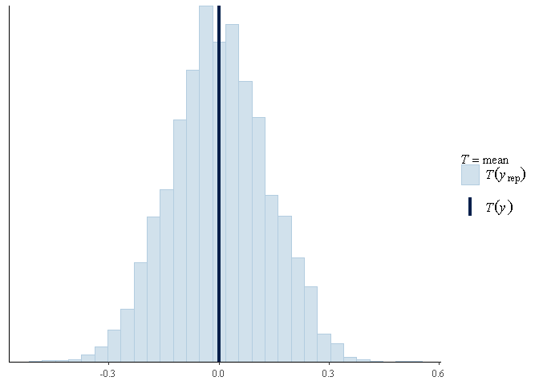

Results of previous experiments
-------------------------------

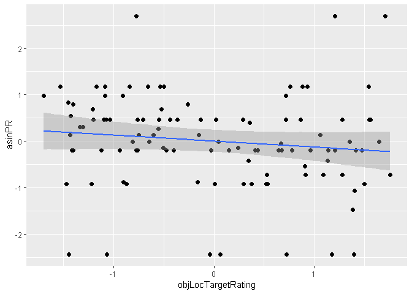

| Method |   BF01|  BF10|
|:-------|------:|-----:|
| BRMS   |  4.526|   0.2|
| UR     |  4.769|   0.2|
| OR     |  2.641|   0.4|

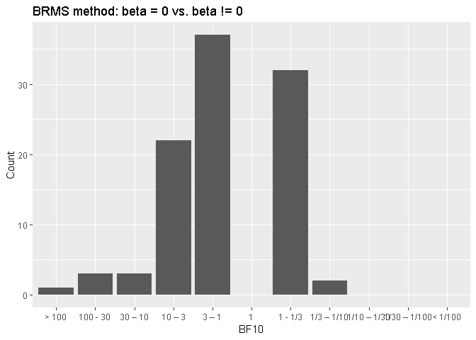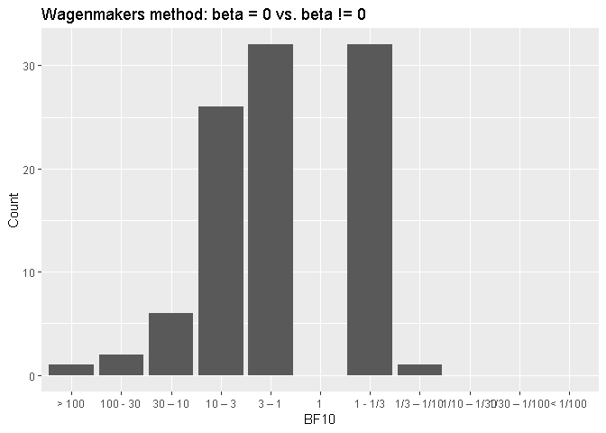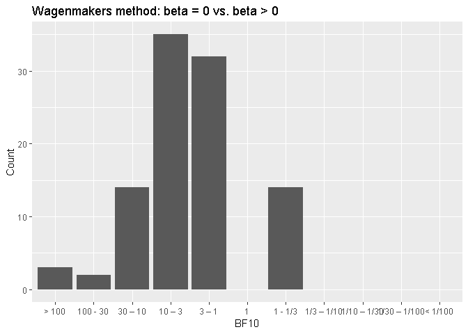

Without taking previous BF10 into account:

| Method |  Over6|  Over10|
|:-------|------:|-------:|
| BRMS   |   0.16|    0.07|
| UR     |   0.17|    0.09|
| OR     |   0.33|    0.19|

With taking previous BF10 into account:

| Method |  Over6|  Over10|
|:-------|------:|-------:|
| BRMS   |   0.04|    0.03|
| UR     |   0.03|    0.03|
| OR     |   0.13|    0.05|

Transformation
--------------

In this context, it is also imporant to think about which transformation of the probability values of recollection. There are two different possbilities: arcsine and probit transformation.

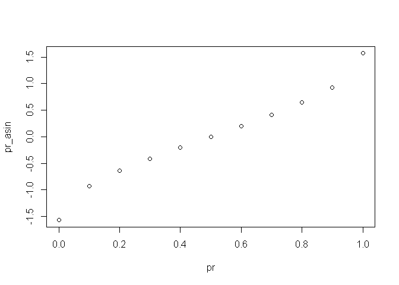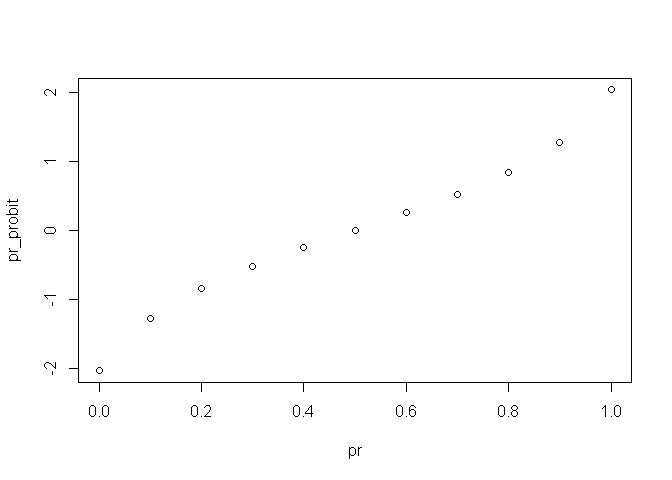

I think we should use the probit transformation because otherwise it reduces our effect because of the assymmetry of the arcsine transformation.

Euclidean Distance
==================

PPC
---

Observed data (y) vs. simulated data (yrep): 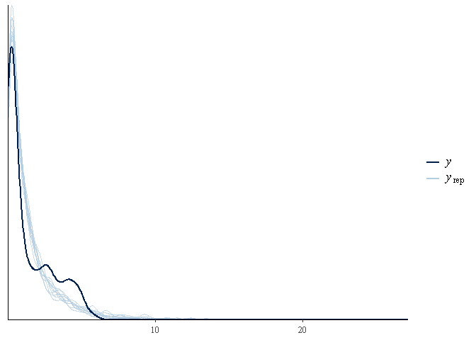

How well did we capture the mean? 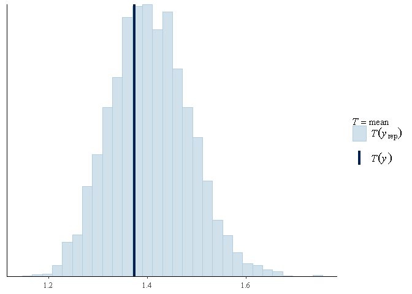

Results of previous experiments
-------------------------------

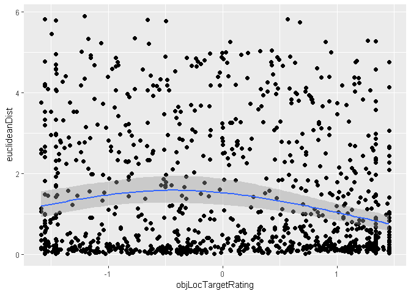

| Method |   BF01|      BF10|
|:-------|------:|---------:|
| BRMS   |  0.000|  120154.9|
| UR     |  0.004|     230.3|
| OR     |  0.002|     460.5|

Power analysis
--------------

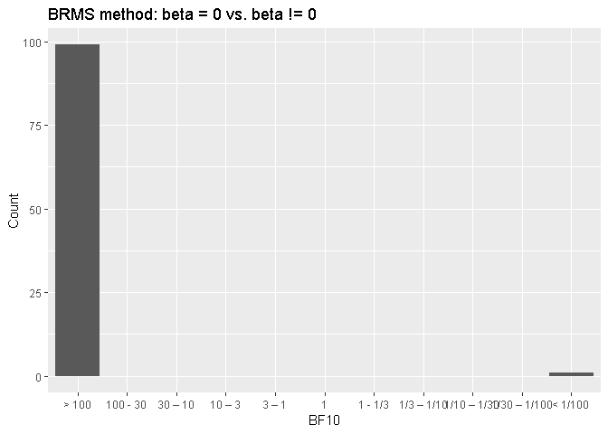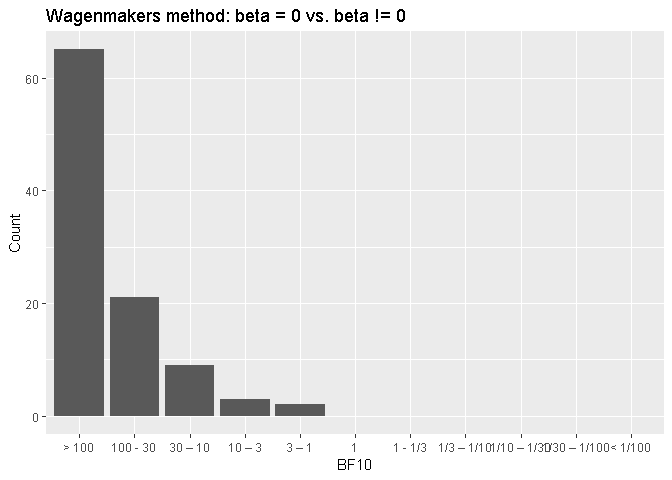

Without taking previous BF10 into account:

| Method |  Over6|  Over10|
|:-------|------:|-------:|
| BRMS   |   0.99|    0.99|
| UR     |   0.97|    0.95|
| OR     |   0.97|    0.95|

With taking previous BF10 into account:

| Method |  Over6|  Over10|
|:-------|------:|-------:|
| BRMS   |      1|       1|
| UR     |      1|       1|
| OR     |      1|       1|

AFC
===

PPC
---

Observed data (y) vs. simulated data (yrep): 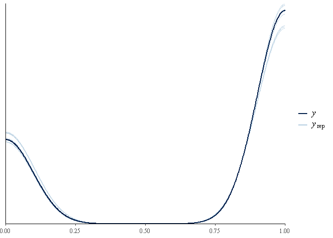

How well did we capture the mean? 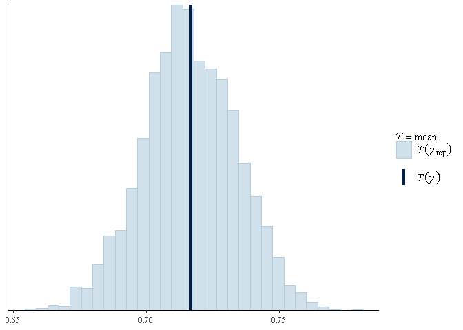

Results of previous experiments
-------------------------------

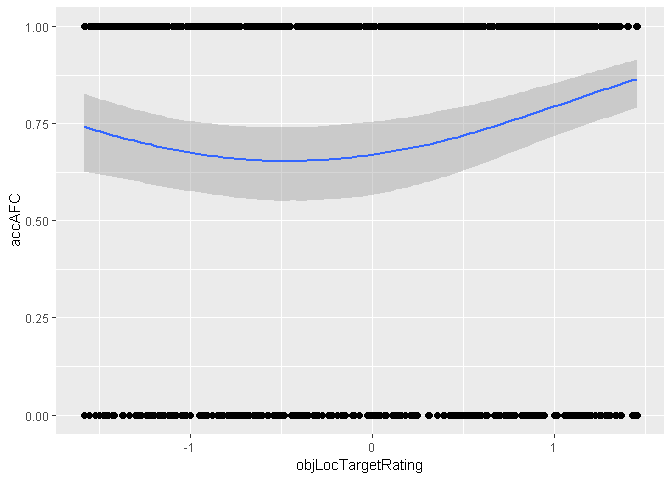

| Method |   BF01|  BF10|
|:-------|------:|-----:|
| BRMS   |  0.055|  18.1|
| UR     |  0.091|  11.0|
| OR     |  0.045|  22.1|

Power analysis
--------------

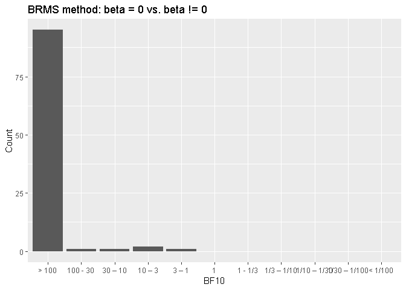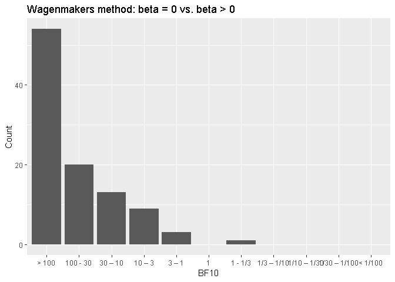

Without taking previous BF10 into account:

| Method |  Over6|  Over10|
|:-------|------:|-------:|
| BRMS   |   0.97|    0.97|
| UR     |   0.91|    0.87|
| OR     |   0.91|    0.87|

With taking previous BF10 into account:

| Method |  Over6|  Over10|
|:-------|------:|-------:|
| BRMS   |   1.00|    1.00|
| UR     |   0.99|    0.99|
| OR     |   1.00|    1.00|
